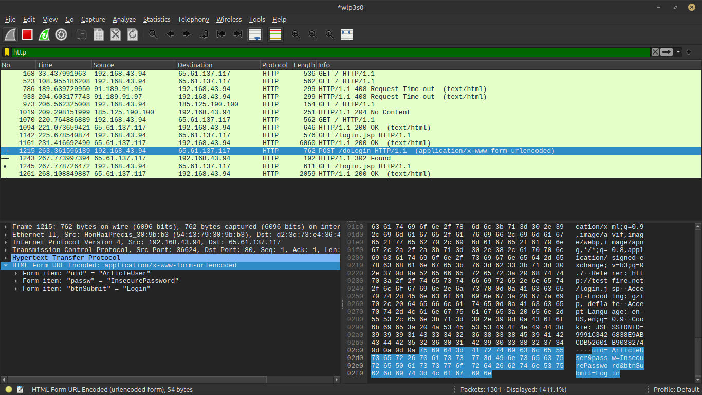
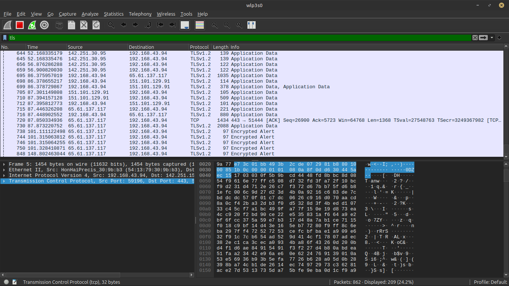

**Skeleton**

Connection is secure. A padlock. The **'S'** in HTTPS. For decades, these have been the signals we trust when browsing the web. 
I trusted them too, but I never stopped to ask what was actually happening beneath that padlock. 
One afternoon, staring at a padlock icon on my browser, a question hit me: IS HTTPS REALLY SAFE? 
I went down the rabbit hole. What I found shocked me. The padlock is not a promise about where you are going. It is only a promise about how you get there. After weeks of research, one thing became clear: the tunnel is safe, but the destination isn't. To understand why, we need to start with the layer that runs this whole thing: HTTP.

Hypertext Transfer Protocol (HTTP) is a foundational rule system that governs how information is exchanged between client and server on the internet. It defines how data is formatted and transmitted, and how web browsers and servers respond to various commands.
HTTP is the core language of the World Wide Web. With HTTP, a client, typically a web browser, requests a resource from a server, and the server responds with a status code and the requested resource. This is what we call the request-response system.
Though HTTP forms the foundation for the World Wide Web, transferring data in plaintext poses a huge security risk. With the right tool and technical know-how, anyone on the same network could intercept data in transit. This is called a Man-In-The-Middle(MITM) attack. 
Think of it like delivering an unsealed letter through a delivery agency to a friend. The delivery man can see the contents of the letter and also tamper with it before it gets to your friend. 
This is exactly how a MITM happens over HTTP.
To prove this, I conducted a lab using testfire.net as our case study.

Url: http://testfire.net

> From the capture, we can observe the complete HTTP login transaction. The browser first requests the login page (GET /login.jsp), then submits the login form through a POST /doLogin request. Because HTTP transmits data without encryption, Wireshark is able to decode the request body and display the submitted form fields in plaintext. The username (ArticleUser) and password (InsecurePassword) are clearly visible in the packet details, demonstrating that sensitive information can be exposed to anyone capable of intercepting the network traffic.

As the World Wide Web grew, this vulnerability was exploited by many, and so the need for a secure type of HTTP was necessitated. HTTPS was the solution to this.

**What Is HTTPS?**

Hypertext Transfer Protocol Secure(HTTPS) is simply HTTP over a security layer. This security layer is called the **Transport Layer Security(TLS)**: a security or cryptographic protocol that encrypts data sent over the internet to keep it private and safe. During data transfer over HTTPS, there's a key share which grants data privacy by encrypting it. This helps improve Confidentiality and integrity over the internet. In other words, HTTPS is HTTP over TLS. 

To understand this better, a lab was conducted over HTTPS using testfire.net as a case study and the same login credentials.

URL: https://testfire.net

> The capture above shows the same login activity performed over HTTPS. Unlike the previous HTTP capture, Wireshark is unable to reveal the contents of the communication. Instead of displaying HTTP requests such as GET and POST, the packets appear as TLS Application Data, indicating that the application-layer data has been encrypted before transmission. The packet payload consists only of encrypted bytes, making the username, password, and other sensitive information unreadable to anyone intercepting the traffic. Although an attacker can still observe metadata such as the communicating IP addresses, the use of TLS prevents them from viewing or modifying the data exchanged between the client and the server.

The difference between HTTP and HTTPS is now visible. In the HTTP capture, the login credentials were exposed because data is transferred in plaintext. In the HTTPS capture, the same type of communication appears only as encrypted TLS application data, preventing anyone intercepting the traffic from reading the contents.

The current version of the Transport Layer Security(TLS) running the web is version 1.3(v1.3). Initially, the Secure Socket Layer(SSL) was the protocol powering web security. Created in 1994 by Netscape, SSL 1.0  was never released to the public due to the severe security and design flaws revealed by internal testing. SSL 2.0 was released to the public in 1995 and was succeeded by SSL 3.0 in 1996. SSL used weak Message Authentication Codes(MAC) and Algorithms like MD5, which could be exploited easily. Also, as the web grew, the industry needed an open vendor protocol to enhance web security rather than a sole proprietary Netscape product; hence, the Internet Engineering Task Force(IETF), an international open standard organization, introduced TLS to standardize internet encryption and fix critical cryptographic vulnerabilities inherent to Netscape's proprietary code.

For TLS to work effectively, thus protecting data in transit, the client and server go through a process to establish trust and secure communication methods before encrypted data is transferred. This process is known as **TLS Handshake**

TLS handshake is a communication process that initiates a secure connection between a client and a server. This handshake is also responsible for key creation. Unlike SSL and earlier versions of TLS, TLS 1.3 uses 1 Round Trip Time(1RTT) to establish a secure connection between the client and server. 

### How the TLS handshake occurs
During a TLS handshake, the client sends a **ClientHello**, which is a single message containing:
- Supported versions: the client sends its supported protocol version
- Cipher suites: a list of all the encryption algorithms
- Key shares: the client shares its secret key using an Elliptic Curve Diffie-Hellman(ECDHE): a modern protocol that lets two people make a secret code over a public network. The secret code is never sent out on the network, but both the client and the sever ends up with the same secret. This protocol works together with the [Authenticated Encryption with Associated Data(AEAD) symmetric encryption](https://en.wikipedia.org/wiki/Authenticated_encryption#Authenticated_encryption_with_associated_data) like AES-GCM to generate keys. With the help of the discrete logarithm problem, the secret can never be accessed via an attacker sniffing packets.

The server, after processing the client's request, responds with a **ServerHello**: a single message which contains:
- Protocol version: Confirms TLS 1.3 protocol usage
- Cipher suite: the specific encryption algorithm selected by the server from the list the client provided
- Server key share: Sends its own half of the cryptographic key material.

After sending the server hello, the server sends a server-to-client message that proves identity in one flight. The message contains:
- Certificate: Sends the server's digital certificate to prove its identity. A digital certificate is an electronic file that proves the identity of a user, computer, or website. It is issued by a Certificate Authority(CA): a trusted group that signs the file to ensure its legitimacy
- CertificateVerify: A digital signature proving the server owns the private key linked to that certificate.
- Finished: A cryptographic check verifying that a third party did not alter the handshake messages.

The client then responds with a client-to-server message, which is a final confirmation saying:
- The client verifies the server’s certificate and signature.
- The client generates the same shared secret key using the two key shares.
- The client sends its own Finished message, encrypted with the new keys.

After a successful TLS handshake, that is when the client displays the padlock. This is where all problems begin, because we instinctively assign safety with the padlock. The displayed padlock tells you that the server has been verified and also that your data in transit is protected, and nothing about the site, what it does, and others. All it screams is safety about the journey, not the destination. This is what I term as: ***The Tunnel is Safe, but The Destination Isn't***

### What HTTPS does not protect.
Although established that HTTPS grants protection, it does not promise full security. 
- HTTPS does not protect us from phishing and scams. A malicious site like the one with the intent of phishing can gain a valid certificate from automated Certificate Authorities(CAs) like Let's Encrypt and ZeroSSL that require proof that you control the domain name and not whether the business or site is legit. Attackers exploit these free automated CAs and perform malicious act. During events like this, the padlock was never missing. It was present, but it only screamed about the safety of the tunnel and not the destination. This is why, regardless of the education on web safety, phishing and online scams are on the rise. We instinctively trusted the padlock without knowing what it says

### Where HTTPS breaks

